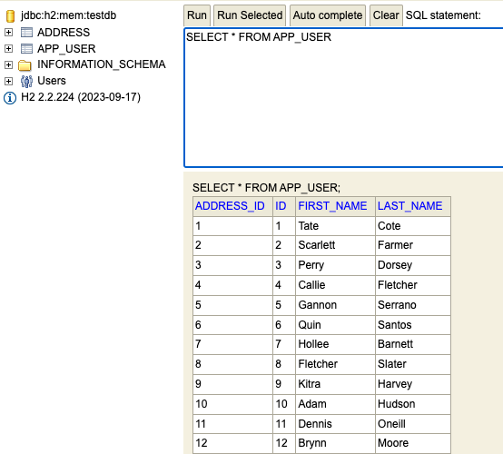

# Experimental CSV Uploader

This Vaadin Flow app allows the user to upload a CSV file (see `src/main/resources/input.csv`) which will then be displayed in a Grid. The app also shows ComboBoxes for each CSV column. The user can then select to which database entity the CVS columns should map. If all ComboBoxes have a selected value, a click on the save button will then persist it into a locally runnning H2 (in memory) database.

The database can be viewed by visiting the [H2 console](http://localhost:8080/h2-console) (using sa/password) as credentials.

## Remarks

Note that the dev time was time boxed to 6 hours and I do not have any experience with Vaadin. I.e. the implementation is pretty basic and there are also no tests. It was primarily done for learning purposes.

## Screenshots

## Running the application

The project is a standard Maven project. To run it from the command line,
type `mvnw` (Windows), or `./mvnw` (Mac & Linux), then open
http://localhost:8080 in your browser.

You can also import the project to your IDE of choice as you would with any
Maven project. Read more on [how to import Vaadin projects to different IDEs](https://vaadin.com/docs/latest/guide/step-by-step/importing) (Eclipse, IntelliJ IDEA, NetBeans, and VS Code).